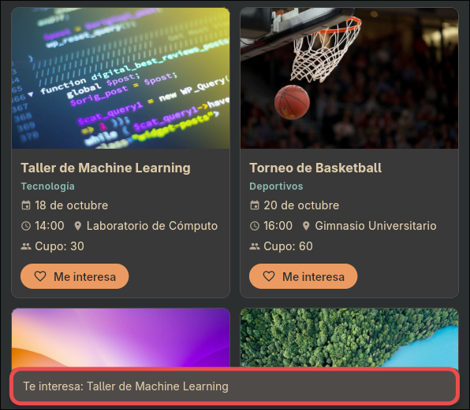

# Campus Eventos

Aplicación en Flutter para consultar eventos universitarios, filtrarlos por categoría e interactuar con cada uno de ellos.

## Descripción

**Campus Eventos** permite a los estudiantes consultar las actividades que se realizan dentro de la institución. Los eventos se organizan en cinco categorías — Académicos, Deportivos, Culturales, Tecnología y Talleres — y cada uno muestra imagen, nombre, categoría, fecha, hora, lugar y cupo disponible.

Incluye **18 eventos** almacenados en un archivo de datos independiente y un tema visual propio basado en la paleta Gruvbox Dark con Material 3.

## Requerimientos

- Flutter SDK (versión estable reciente)
- Dart 3.x compatible con el SDK de Flutter

## Instalación

```bash
git clone https://github.com/Andrew869/flutter-app-eventos.git
cd flutter-app-eventos
flutter pub get
flutter run
```

## Características

- Filtrado de eventos por categoría mediante chips.
- Contador de "Eventos encontrados" actualizado dinámicamente.
- Botón "Me interesa" con confirmación mediante SnackBar.
- Diseño responsivo: 2 columnas en celular, 3 en tablet y 4 en pantallas amplias.
- Tema personalizado Gruvbox Dark (Material 3).
- Imágenes de red con fallback ante errores de carga.

## Estructura del proyecto

```
lib/
+-- main.dart
+-- data/
    +-- event_data.dart
+-- screens/
    +-- home_page.dart
+-- widgets/
    +-- event_card.dart
    +-- category_chip.dart
+-- theme/
    +-- app_theme.dart
```

## Capturas de pantalla

### Vista en dispositivo móvil (2 columnas)

.png)

### Vista en pantalla ampliada (4 columnas)

.png)

### SnackBar de confirmación



## Documentación

La documentación completa del proyecto (informe LaTeX y capturas) se encuentra en la carpeta [`documentacion/`](documentacion/).

## Tecnologías

- Flutter SDK
- Dart
- Material Design 3
- Paleta Gruvbox Dark